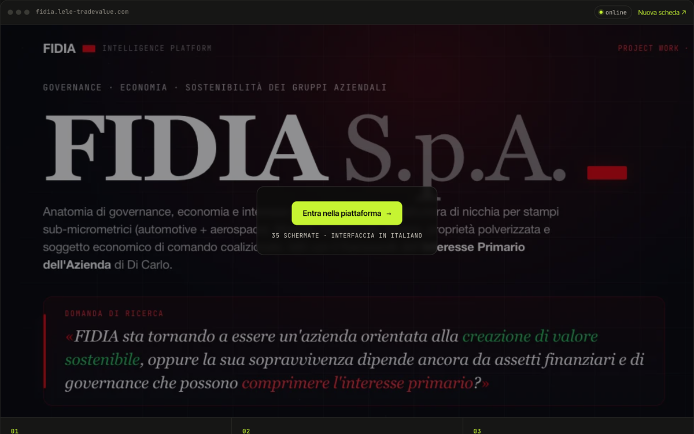

# FIDIA

> Un caso di governance aziendale diventato una piattaforma da esplorare, dove ogni numero porta alla sua fonte.

`01` · **Project work magistrale · Tor Vergata** · 2025–26 · Analisi, progettazione e sviluppo

[**▶ Prova la demo**](https://portfolio.lele-tradevalue.com/progetti/fidia/#demo) · [Caso studio completo](https://portfolio.lele-tradevalue.com/progetti/fidia/) · [Piattaforma online ↗](https://fidia.lele-tradevalue.com/) · [English version](https://portfolio.lele-tradevalue.com/en/progetti/fidia/)

## Il problema

Il corso di Governance, Economia e Sostenibilità dei Gruppi Aziendali chiedeva di applicare la teoria a un caso reale, non di raccontarlo. Le slide però appiattiscono tutto: relazioni tra società, equilibri economici e fonti finiscono in elenchi difficili da verificare.

## Cosa ho costruito

Ho analizzato il gruppo FIDIA a partire dai documenti pubblici e ho costruito una piattaforma web al posto della presentazione: 35 schermate in tre parti — governance e attori, gruppo aziendale, interesse primario — con modelli interattivi invece di grafici statici. Ogni dato cita documento, sezione e pagina. Un assistente AI risponde alle domande parlando come l’azienda, e un controllo indipendente verifica ogni risposta prima di mostrarla.

## Come funziona

1. **La teoria viene prima** — Ogni schermata parte da un concetto del corso — l’azienda-persona, il gruppo come sistema, i quattro equilibri — e solo dopo porta i numeri del caso.
2. **Fonti a un clic** — Una base dati strutturata collega ogni cifra al documento originale: un clic sull’etichetta apre la citazione esatta.
3. **Modelli da toccare** — Un cubo 3D classifica le società del gruppo su tre dimensioni; un tetraedro mostra come i quattro equilibri si muovono dal 2021 al 2025.
4. **Un assistente con un guardiano** — L’AI consulta il materiale e risponde; un secondo controllo verifica la risposta e, quando serve, indica quale organo umano deve decidere.

## Perché funziona

- **Nessun numero senza fonte.** La tracciabilità vive dentro l’interfaccia, non in una bibliografia in fondo.
- **35 schermate, non un deck.** Si naviga per parti, con tastiera o menu, e si approfondisce dove serve.
- **3D dove aiuta davvero.** Il cubo ADEF rende visibile una classificazione a tre assi; su telefono diventa una doppia matrice 2D.
- **AI di supporto, decisioni alle persone.** L’assistente aiuta a ragionare; la responsabilità resta agli organi di governance.

## In numeri

| | |
|---:|---|
| **35** | schermate interattive |
| **3** | parti di analisi |
| **29** | documenti nel corpus |
| **1** | piattaforma online |

## Stack

`React` `TypeScript` `Three.js` `D3` `Python` `FastAPI`

## Cosa resta privato

Lavoro accademico basato su documenti pubblici: non è un incarico per FIDIA S.p.A. Corpus completo, prompt e codice restano privati. Questo repository contiene solo la presentazione del progetto: niente codice sorgente, cronologia o configurazioni.

<b>In English</b>

**FIDIA** — A corporate governance case study turned into a platform you can explore, where every number leads back to its source.

I analysed the FIDIA group from its public documents and built a web platform instead of a slide deck: 35 screens in three parts — governance and actors, the business group, primary interest — with interactive models instead of static charts. Every figure cites its document, section and page. An AI assistant answers questions speaking as the company, and an independent check reviews every answer before it is shown.

- **No figure without a source.** Traceability lives inside the interface, not in a bibliography at the end.
- **35 screens, not a deck.** You move through the parts with the keyboard or menu, and dig deeper where it matters.
- **3D where it actually helps.** The ADEF cube makes a three-axis classification visible; on phones it becomes a pair of 2D matrices.
- **AI supports, people decide.** The assistant helps people think; responsibility stays with the governance bodies.

[Read the full case study and try the demo →](https://portfolio.lele-tradevalue.com/en/progetti/fidia/)

---

Emanuele Montalto · [portfolio](https://portfolio.lele-tradevalue.com) · [LinkedIn](https://www.linkedin.com/in/emanuele-montalto/) · [montalto36@gmail.com](mailto:montalto36@gmail.com)
